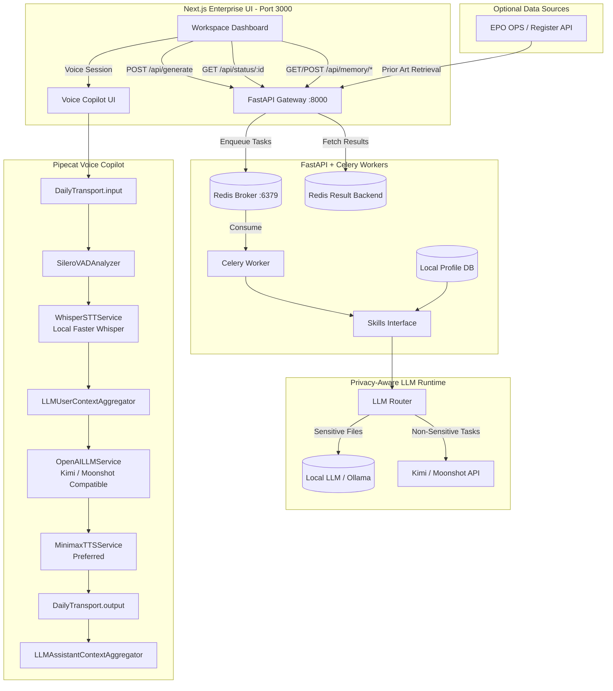

# ⚖️ PatentFlow — Privacy-Aware Agentic Patent Prosecution Workspace


**PatentFlow** is an enterprise-grade, privacy-aware Document Processing Workspace designed for **European Patent Attorneys**. It targets the realities of prosecution work:

- **Art. 123(2) EPC** risk (added matter) where wording choices can be fatal
- **Art. 56 EPC** inventive-step mapping where semantic interpretation matters
- **Client confidentiality** where “cloud by default” is not acceptable
- **Real-time attorney interaction** through a voice-first AI copilot

PatentFlow is not a generic chatbot. It is a structured, auditable, attorney-in-the-loop prosecution workspace that combines live EPO data, local/private LLM routing, optional high-quality API reasoning, and real-time voice interaction.

Built by an IP professional, for IP professionals.

---

## Why PatentFlow

### 1) Legal accuracy under institutional constraints
Patent prosecution is not “generic writing.” It is **risk management**:

- A single phrasing shift can trigger an Art. 123(2) issue
- Inventive-step reasoning requires structured, repeatable mapping
- Prior-art analysis requires grounded evidence, not hallucinated citations
- Quality and traceability matter more than “chatty” UX

PatentFlow focuses on structured outputs such as claim charts, translation risk checks, and draft prosecution responses that remain reviewable by a qualified patent attorney.

### 2) Privacy-aware operation for client confidentiality
PatentFlow is designed around **privacy-aware LLM routing**:

- Sensitive client files can be routed to local LLMs
- Offline / air-gapped deployment remains possible for core workflows
- Non-sensitive reasoning can use Kimi / Moonshot API via OpenAI-compatible mode
- Local persistence for attorney-specific preferences
- No sensitive client data should be written to logs or external telemetry

The principle is simple:

> Sensitive data stays local. Non-sensitive reasoning can use high-quality API models.

### 3) Real-time voice copilot for prosecution work
PatentFlow is not only a document automation tool. It also includes a **voice-first AI copilot** built with a Pipecat pipeline.

Attorneys can speak naturally to the system and ask questions such as:

- “What is the main difference between Claim 1 and D1?”
- “Can we argue that D1 lacks dynamic TDRA configuration?”
- “Check whether this amendment creates Art. 123(2) risk.”
- “Rewrite this response in a more formal EPO attorney style.”

The voice copilot is designed to make prosecution review more interactive, especially during first-pass analysis, claim chart inspection, and draft refinement.

### 4) Enterprise UX: minimal, information-dense, institutional
The UI follows a **Bloomberg Terminal-style** aesthetic:

- High signal density
- Subtle controls
- Low-friction review of structured outputs
- Calm, traceable progress for long-running legal analysis tasks

---

## Legal Disclaimer & Usage Policy

> **The attorney is the pilot; AI is the co-pilot.**

PatentFlow is a specialized productivity tool for patent prosecution workflows. It assists with document analysis, prior-art comparison, claim chart generation, translation checks, and draft response preparation.

It does **not** replace the professional judgment, legal advice, or strategic responsibility of a qualified patent attorney. All outputs are designed for attorney review, validation, and final approval before any professional or procedural use.

---

## Trade Secret / Black Box Disclaimer

Specific system prompts, proprietary dictionaries, attorney-style rules, and heuristic parsing algorithms are **intentionally omitted** from this public repository to protect intellectual property.

PatentFlow exposes stable interfaces and deterministic boundaries while keeping core prompt logic and proprietary linguistic assets internal.

---

## System Architecture



## Offline Fine-Tuned Model

PatentFlow now includes a dedicated offline amendment-support model for privacy-aware prosecution workflows:

- Hugging Face model: [`sinonchum/patentflow-qwen3-8b-amend-support`](https://huggingface.co/sinonchum/patentflow-qwen3-8b-amend-support)
- Base model: `Qwen/Qwen3-8B`
- Method: QLoRA adapter fine-tuning with 4-bit NF4 quantization
- Task: classify whether supplied evidence supports a proposed amendment or support assertion
- Output: structured JSON with support label, failure types, confidence, rationale, and attorney-review flag

This model is designed for local or controlled-infrastructure deployment. It supports first-pass amendment support triage, helps surface missing elements or weak support chains, and routes uncertain cases to attorney review. It is a decision-support component, not a substitute for professional legal judgment.

## Environment Setup

### Prerequisites

- **Python 3.11** for the FastAPI API, Celery worker, and core pipeline
- **Node.js 20+** for the Next.js frontend
- **Redis 7** as the Celery broker / result backend
- **Docker + Docker Compose** if you prefer containerized startup
- **Optional:** Ollama or another OpenAI-compatible local endpoint for privacy-sensitive tasks
- **Optional:** Moonshot / Kimi, OpenAI, or Anthropic-compatible credentials for non-sensitive cloud reasoning
- **Optional:** EPO OPS credentials for live EPO data ingestion
- **Optional:** Daily + MiniMax credentials for the voice copilot

### 1) Install backend dependencies

```bash
python3.11 -m venv venv
source venv/bin/activate
pip install --upgrade pip
pip install -r requirements.txt
```

### 2) Install frontend dependencies

```bash
cd frontend
npm ci
cd ..
```

### 3) Create a root `.env` file

Create a `.env` file in the project root and start with the following template:

```bash
# Core runtime
REDIS_URL=redis://localhost:6379/0
ALLOWED_ORIGINS=http://localhost:3000
PATENTFLOW_API_KEY=

# Optional: enable live EPO ingestion
EPO_ENABLED=false
EPO_CONSUMER_KEY=
EPO_CONSUMER_SECRET=

# Local/private LLM routing
LLM_BASE_URL=http://127.0.0.1:11434
LLM_MODEL=
LLM_API_KEY=

# Optional: cloud reasoning for non-sensitive tasks
# For Moonshot / Kimi, keep CLOUD_PROVIDER=openai because the API is OpenAI-compatible.
CLOUD_PROVIDER=openai
CLOUD_BASE_URL=https://api.moonshot.cn
CLOUD_MODEL=moonshot-v1-8k
OPENAI_API_KEY=

# Optional: voice copilot
MOONSHOT_API_KEY=
MOONSHOT_BASE_URL=https://api.moonshot.cn/v1
MOONSHOT_MODEL=moonshot-v1-8k
DAILY_SAMPLE_ROOM_URL=
DAILY_API_KEY=
DAILY_TOKEN=
DAILY_CLIENT_TOKEN=
MINIMAX_API_KEY=
MINIMAX_GROUP_ID=
MINIMAX_VOICE_ID=male-qn-qingse
VOICE_SERVER_HOST=0.0.0.0
VOICE_SERVER_PORT=7860
```

Notes:

- If `LLM_MODEL` is left empty and no cloud model is configured, the application can still boot, but LLM-dependent features may fall back to the built-in mock engine for debugging.
- `NEXT_PUBLIC_API_BASE_URL` is used by the frontend and should usually be `http://localhost:8000` in local development.
- If you use an OpenAI-compatible local endpoint instead of native Ollama, set `LLM_BASE_URL` to that endpoint and provide `LLM_API_KEY` if required.

## How to Run

### Option A: Run the core stack with Docker Compose

This starts Redis, the FastAPI API, the Celery worker, and the frontend.

```bash
docker compose up --build
```

After startup:

- Frontend: `http://localhost:3000`
- API docs: `http://localhost:8000/docs`
- Redis: `localhost:6379`

### Option B: Run locally for development

#### 1) Start Redis

If you already have Redis installed locally, start that service. Otherwise you can use Docker just for Redis:

```bash
docker run --rm -p 6379:6379 redis:7-alpine
```

#### 2) Start the FastAPI backend

```bash
source venv/bin/activate
uvicorn src.api:app --host 0.0.0.0 --port 8000 --reload
```

#### 3) Start the Celery worker

Open a second terminal:

```bash
source venv/bin/activate
celery -A src.celery_app.celery_app worker --loglevel=info --concurrency=1 --prefetch-multiplier=1
```

#### 4) Start the frontend

Open a third terminal:

```bash
cd frontend
NEXT_PUBLIC_API_BASE_URL=http://localhost:8000 npm run dev
```

Then open `http://localhost:3000`.

### Optional: Run the CLI pipeline directly

For offline or script-based testing, you can run the pipeline without the web UI:

```bash
source venv/bin/activate
bash scripts/run_pipeline.sh data/raw/sample_oa.txt
```

With a specification file:

```bash
source venv/bin/activate
bash scripts/run_pipeline.sh data/raw/sample_oa.txt realCase/case1_EP3654128_5G-NR-Scheduling/specification.txt
```

Generated artifacts are written to `data/output/`.

### Optional: Run the voice copilot

Install the voice-specific dependencies:

```bash
source venv/bin/activate
pip install -r voice_pipeline/requirements.txt
```

Start the voice server:

```bash
source venv/bin/activate
uvicorn voice_pipeline.server:app --host 0.0.0.0 --port 7860 --reload
```

The voice UI is served from `http://localhost:7860/`. To use it, configure either `DAILY_API_KEY` for dynamic room creation or `DAILY_SAMPLE_ROOM_URL` for a fixed test room, plus the required Moonshot and MiniMax credentials in `.env`.


Demo Video link: https://www.youtube.com/watch?v=hJniZueUi50
