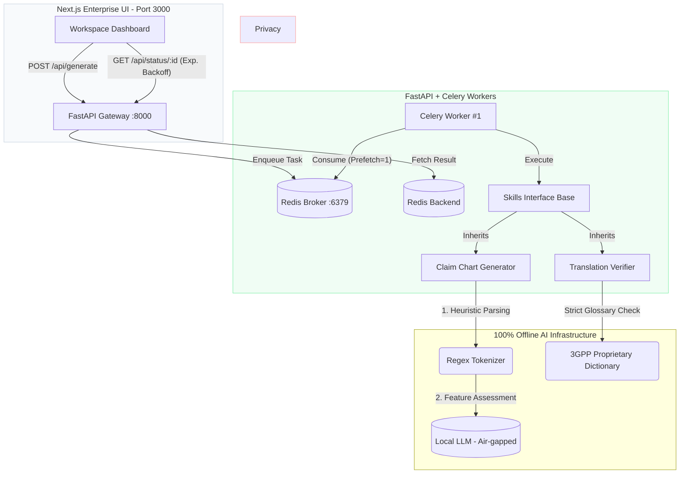

# ⚖️ PatentFlow: Agentic Patent Prosecution Workspace


**PatentFlow** is an enterprise-grade, privacy-first Document Processing Workspace. Designed strictly for European Patent Attorneys, it handles heavy-document processing via a **hardened asynchronous task queue (Celery + Redis)** and deterministic Python Agent Skills, while strictly maintaining 100% offline, air-gapped operation for client confidentiality.

*Built by an IP professional, for IP professionals.*


---

## 💡 The "Why" (Design Philosophy)

After four years of working as a Patent Assistant handling Telecommunications and Optics files, I observed three major bottlenecks in LegalTech adoption:

1. **Client Confidentiality**: Public cloud AI (ChatGPT, Claude) is strictly prohibited for unpublished patent drafts.
2. **Legal Hallucinations**: Standard LLMs fail to respect rigid EPO frameworks. They hallucinate differences between "comprising" and "consisting of" (fatal for Art. 123(2)) and struggle to map specific features to Prior Art (Art. 56).
3. **Concurrency & OOM**: Heavy local LLM inference and regex parsing can easily cause HTTP timeouts or exhaust GPU memory (OOM) when multiple attorneys use the tool synchronously.

**PatentFlow** solves this with:
- **100% offline local AI** constrained by deterministic Python OOP structures and unit tests.
- **OOM-Protected Task Queuing** (Celery + Redis configured with strict `concurrency=1` and `prefetch_multiplier=1`) to gracefully handle firm-wide concurrent requests.
- **DDoS-Resistant UX** via a Next.js UI utilizing exponential backoff polling, preventing user anxiety without overloading the Redis broker.

---

## 🏗️ System Architecture & Asynchronous Flow

PatentFlow employs a decoupled microservices architecture. Heavy LLM reasoning is offloaded to background workers, allowing the UI to remain highly responsive.



---

## ✨ Core Capabilities (The Agent Skills)

> **Note**: Specific LLM system prompts, proprietary 3GPP mapping dictionaries, and core heuristic regex parsing algorithms are intentionally omitted from this public repository to protect the underlying intellectual logic. The demonstrable features include:

### 1. Dual-Verification Translator (Art. 123(2) Mitigation)
**Architecture**: A deterministic checker bypassing the LLM.


**Logic**: It cross-references the English translation against the Chinese original using a hardcoded legal glossary. It automatically flags lethal verb-scope mismatches (e.g., translating "包括" as the closed-ended "consisting of" instead of "comprising") with critical amber warnings to prevent unallowable amendments.

### 2. Automated Claim Charting (Art. 56 Analysis)
**Architecture**: A hybrid Heuristic + LLM approach.


**Logic**:

- **Tokenizer**: A deterministic Python parser splits independent claims into specific features (e.g., 1.1, 1.2) using transitional phrases.
- **Evaluator**: The local LLM is then prompted feature-by-feature to locate the exact disclosure in the Prior Art (D1), returning structured JSON (`assessment`: Yes/No/Partial, `d1_disclosure`: "Paragraph [0045]").

### 3. EPO Response Drafting
Auto-generates formal response letters based on predefined examiner biases. Exports to clean, standard-compliant formatting.


---

## 🧪 Testing & Reliability

Because legal terminology requires absolute precision, the core deterministic skills are covered by `pytest`.

- **Verifier Tests**: Ensures that boundary-crossing terms (e.g., mixing up "based on" and "in response to") trigger immediate **CRITICAL** risk alerts, guaranteeing the system never quietly accepts a fatal Art. 123(2) error.
- **LLM Fallbacks**: Celery workers are configured with `autoretry_for=(Exception,)` and exponential backoff, ensuring that if the local LLM times out or returns malformed JSON, the task gracefully retries without crashing the pipeline.

---

## 🚀 Quick Start (Local Deployment)

### Option A: Docker Compose (Production-like)
The entire asynchronous stack (UI, API, Redis, Celery) can be spun up using Docker.

```bash
docker compose up --build -d
```

- **Frontend**: http://localhost:3000
- **API Docs (Swagger UI)**: http://localhost:8000/docs

### Option B: Manual Startup (For Development)
**Requires**: Python 3.9+, Node.js 18+, Redis instance.

```bash
# 1. Start Redis Server
redis-server

# 2. Start FastAPI Gateway
REDIS_URL=redis://localhost:6379/0 uvicorn src.api:app --host 0.0.0.0 --port 8000

# 3. Start Celery Worker (Strict concurrency for local LLM)
REDIS_URL=redis://localhost:6379/0 celery -A src.celery_app.celery_app worker -l info --concurrency=1 --prefetch-multiplier=1

# 4. Start Next.js Frontend
cd frontend && npm install && NEXT_PUBLIC_API_BASE_URL=http://localhost:8000 npm run dev
```

---

## 📁 Project Structure

```plaintext
PatentFlow/
├── src/
│   ├── api.py              # FastAPI endpoints + CORS
│   ├── celery_app.py       # Celery & Redis configuration
│   ├── tasks.py            # Async LLM task definitions
│   └── skills/             # Agent Skills (ClaimChart, Verifier)
│       ├── __init__.py
│       ├── base.py         # SkillResult envelope
│       ├── claim_chart.py  # Art. 56 Claim Chart Generator
│       └── verifier.py     # Art. 123(2) Translation Verifier
├── frontend/
│   └── src/app/page.tsx    # Next.js Workspace UI
├── docker-compose.yml      # Microservices orchestration
└── requirements.txt        # Python dependencies
```

---

## 🗺️ Roadmap (Prioritized for Firm Integration)

Based on architectural reviews and EPO workflow priorities, upcoming features are staged as follows:

- [ ] **Priority 1: SSE Streaming (UX)**: Upgrade the frontend polling mechanism to Server-Sent Events (SSE) for real-time, typewriter-effect rendering, crucial for maintaining attorney focus during 30s+ LLM generation times.

- [ ] **Priority 2: .Docx Export Workflow (Adoption)**: Integrate `python-docx` to allow attorneys to export the generated Claim Charts directly into MS Word with "Track Changes" enabled, ensuring seamless integration into existing firm workflows.

- [ ] **Priority 3: Local RAG Integration (Depth)**: Implement ChromaDB to chunk and index massive 3GPP Technical Specifications (e.g., TS 38.214). This will require precise TS chunking strategies to drastically reduce GPU VRAM usage and eliminate context-window hallucination.

---

*Disclaimer: This project demonstrates the intersection of software engineering and patent prosecution. It is designed to assist, not replace, the strategic judgment of a qualified European Patent Attorney.*
