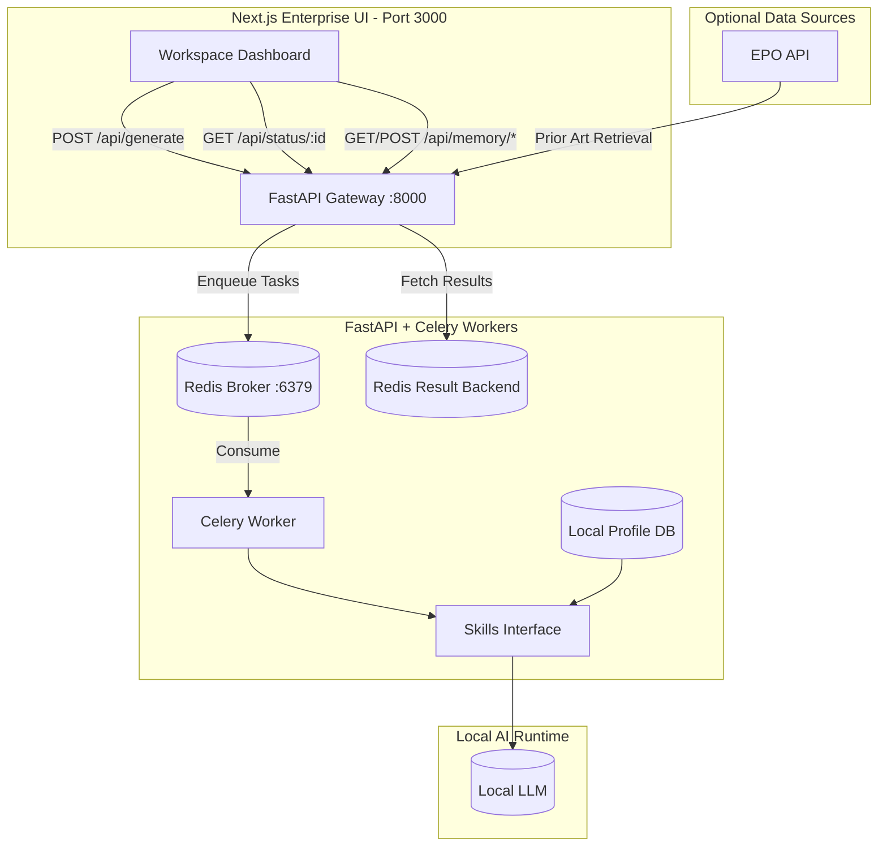

# ⚖️ PatentFlow — Offline Agentic Patent Prosecution Workspace


**PatentFlow** is an enterprise-grade, privacy-first Document Processing Workspace designed for **European Patent Attorneys**. It targets the realities of prosecution work:

- **Art. 123(2) EPC** risk (added matter) where wording choices can be fatal
- **Art. 56 EPC** inventive-step mapping where semantic interpretation matters
- **Client confidentiality** where “cloud by default” is not acceptable

Built by an IP professional, for IP professionals.

---

## Why PatentFlow

### 1) Legal accuracy under institutional constraints
Patent prosecution is not “generic writing.” It is **risk management**:
- A single phrasing shift can trigger an Art. 123(2) issue
- Inventive-step reasoning requires structured, repeatable mapping
- Quality and traceability matter more than “chatty” UX

### 2) 100% offline operation for client confidentiality
PatentFlow is designed to run fully locally:
- Local LLM execution (air-gapped capable)
- No external SaaS dependencies required for core workflows
- Local persistence for attorney-specific preferences

### 3) Enterprise UX: minimal, information-dense, institutional
The UI follows a **Bloomberg Terminal-style** aesthetic:
- High signal density
- Subtle controls
- Low-friction review of structured outputs

---

## Trade Secret / Black Box Disclaimer (Intentional)
Specific system prompts, proprietary dictionaries, and heuristic parsing algorithms are **intentionally omitted** from this public repository to protect intellectual property.

PatentFlow exposes stable interfaces and deterministic boundaries while keeping core prompt logic and proprietary linguistic assets internal.

---

## System Architecture (High-Level)



---

## Core Capabilities

### 1) Art. 56 Claim Chart Generation (LLM-Assisted, Structured Output)
Generate an attorney-reviewable claim chart with:
- Feature-by-feature claim splitting
- Prior art excerpt anchoring (D1/D2)
- LLM semantic assessment:
  - `Yes` / `No` / `Partial`
  - reasoning captured per row for auditability

### 2) Art. 123(2) Translation Verification (High-Risk Terminology Guardrails)
A verification workflow designed to surface:
- semantic mismatches
- risky wording drift
- institutional terminology consistency

### 3) Dynamic Attorney Memory (Local Persistent Context Injection)
PatentFlow supports a **Local User Preference Engine** that stores and recalls attorney preferences entirely offline:

- **SQLite-backed memory** (zero external dependencies)
- Profile-specific preferences persisted across sessions
- Preferences are dynamically injected into the LLM system context at runtime

**Business value**
- Enforces firm-wide house style and attorney-specific drafting habits
- Reduces “micro-friction” edits and repeated preference corrections
- Supports consistent examiner strategy posture across matters

### 4) One-Click EPO Prior Art Ingestion
PatentFlow integrates EPO retrieval to support:
- automated ingestion of cited prior art (e.g., D1/D2 full text)
- reduced manual copy/paste and document hunting
- faster turnaround from Office Action to structured analysis

**Business value**
- Cuts administrative time
- Increases completeness and consistency of cited-document context
- Improves auditability of the evidence basis used in analysis

---

## Quick Start

### Option A — Docker (recommended for reproducibility)
1) Configure environment:
- Copy `.env.example` → `.env`
- Set `NEXT_PUBLIC_API_BASE_URL`, `REDIS_URL`, and LLM configuration as needed

2) Start services:
```bash
docker compose up --build
```

Typical services:
- `frontend` (Next.js UI)
- `api` (FastAPI gateway)
- `redis` (broker + result backend)
- `worker` (Celery worker, local LLM calls)

### Option B — Manual (local development)

#### 1) Backend (FastAPI)
```bash
python3 -m venv venv
source venv/bin/activate
pip install -r requirements.txt

export REDIS_URL=redis://localhost:6379/0
uvicorn src.api:app --host 0.0.0.0 --port 8000
```

#### 2) Redis
```bash
redis-server
```

#### 3) Celery Worker
```bash
export REDIS_URL=redis://localhost:6379/0
celery -A src.celery_app.celery_app worker -l info --concurrency=1 --prefetch-multiplier=1
```

#### 4) Frontend (Next.js)
```bash
cd frontend
npm install
npm run dev
```

Open:
- UI: `http://localhost:3000`
- API: `http://localhost:8000/health`

---

## API Overview (Selected)
- `POST /api/generate`
  - Runs the async pipeline (Celery) for claim chart + verification + draft outputs
- `GET /api/status/{task_id}`
  - Poll for progress and results
- `GET /api/memory/{attorney_id}`
  - Retrieve stored preference string
- `POST /api/memory/add`
  - Append a new preference rule for an attorney profile
- `POST /api/generate-chart`
  - Deterministic + LLM-assisted chart generation with optional `attorney_id`

---

## Security & Privacy Posture
- Designed for offline and air-gapped operation
- Local persistence only (SQLite)
- No dependency on third-party analytics, telemetry, or cloud inference for core workflows

---

## Roadmap (Prioritized for Firm Integration)

- [ ] **RAG with ChromaDB (Depth)**  
  Local retrieval over firm-approved corpora (e.g., standards, prior OA templates) to improve long-document reasoning while controlling hallucination risk.

- [ ] **.docx Export Workflow (Adoption)**  
  Export claim charts and drafted responses into Word with firm formatting and review conventions.

- [ ] **SSE Streaming (UX)**  
  Upgrade from polling to server-sent events for long-running generation, keeping the interface calm and traceable.

- [ ] **Policy Packs (Governance)**  
  Versioned preference bundles per firm/practice group to standardize style and examiner strategy guidance.

---

## License / Intended Use
This repository is intended for professional evaluation and internal deployment patterns.

For production firm deployments, additional hardening (audit logs, access controls, document storage policies) is recommended.
