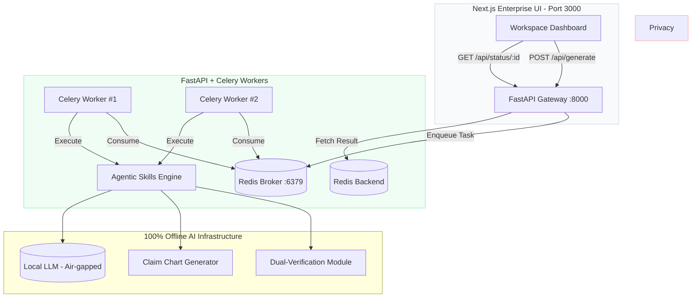

# ⚖️ PatentFlow: Async Patent Prosecution Workspace


**PatentFlow** is an enterprise-grade, privacy-first Document Processing Workspace featuring a robust **asynchronous task queue architecture**. Designed for European Patent Attorneys, it handles concurrent heavy-document processing via Celery + Redis while strictly maintaining 100% offline, air-gapped operation.

*Built by an IP professional, for IP professionals.*

---

## 💡 The "Why" (Design Philosophy)

After four years of working as a Patent Assistant handling Telecommunications and Optics files, I observed three major bottlenecks in legal-tech adoption:

1. **Client Confidentiality**: Public cloud AI (ChatGPT, Claude) is strictly prohibited for unpublished patent drafts.
2. **Legal Hallucinations**: Standard LLMs fail to respect rigid EPO frameworks (e.g., Art. 123(2) added matter, Art. 56 inventive step).
3. **Concurrency & OOM**: Heavy local LLM inference and regex parsing can easily cause HTTP timeouts or exhaust GPU memory (OOM) when multiple attorneys use the tool synchronously.

**PatentFlow** solves this with:
- **100% offline local AI** constrained by deterministic Python Agent Skills.
- **Async task queuing** (Celery + Redis) to gracefully handle firm-wide concurrent requests.
- **Real-time UX** via an optimistic Next.js UI that prevents user anxiety during long LLM generations.

---

## 🏗️ System Architecture

PatentFlow employs a decoupled microservices architecture, isolating the Next.js presentation layer from the heavy Python AI engine.



---

## ✨ Core Capabilities (Agent Skills)

> **Note**: Specific system prompts, proprietary 3GPP mapping dictionaries, and core heuristic regex parsing algorithms are intentionally omitted from this public repository to protect the underlying intellectual logic. The demonstrable features include:

### 1. Dual-Verification Translation (Art. 123(2) Mitigation)
Generates a strict side-by-side alignment: Original CN | Target EN | Reverse-Translation (CN).


**Logic**: Automatically flags verb-scope mismatches (e.g., "comprising" vs "consisting of") with amber highlights to prevent unallowable amendments.

### 2. Automated Claim Charting (Art. 56 Analysis)
Builds a structured 5-column claim chart:
- Feature ID
- Claim Limitation
- Prior Art
- Assessment
- System Remarks

Prior-art mapping is dynamic: if Office Action text contains D1, D2, D3, D4..., the chart can map per feature to the most relevant cited document rather than a fixed single reference.


Processes concurrently through the Celery worker pool, displaying real-time granular progress (Parsing → LLM Matching → Drafting).

### 3. EPO Response Drafting
Auto-generates formal response letters based on predefined examiner biases.


Exports to clean, standard-compliant formatting.

---

## 🚀 Quick Start (Local Deployment)

### Option A: Docker Compose (Recommended for Intranet)
The entire asynchronous stack can be spun up using Docker.

```bash
docker compose up --build -d
```

`docker-compose.yml` sets `NEXT_PUBLIC_API_BASE_URL=http://api:8000` so the frontend container can reach the API container on the Docker network.

- **Frontend**: http://localhost:3000
- **API Docs**: http://localhost:8000/docs

### Option B: Manual Startup (For Development)
**Requires**: Python 3.9+, Node.js 18+, Redis instance.

```bash
# 1. Install Python dependencies
python -m pip install -r requirements.txt
python -m pip install -r requirements-dev.txt

# 2. Initialize environment variables
cp .env.example .env
# If deploying behind intranet domains, set ALLOWED_ORIGINS in .env
# e.g. ALLOWED_ORIGINS=https://patentflow.intra.example.com,https://patentflow-admin.intra.example.com

# 3. Start Redis Server
redis-server

# 4. Start FastAPI Gateway
REDIS_URL=redis://localhost:6379/0 uvicorn src.api:app --host 0.0.0.0 --port 8000

# 5. Start Celery Worker
REDIS_URL=redis://localhost:6379/0 celery -A src.celery_app.celery_app worker -l info

# 6. Start Next.js Frontend
cd frontend && cp .env.local.example .env.local && npm install && npm run dev
```

---

## 📁 Project Structure

```plaintext
PatentFlow/
├── src/
│   ├── api.py              # FastAPI endpoints + CORS
│   ├── celery_app.py       # Celery & Redis configuration
│   ├── tasks.py            # Async LLM task definitions
│   └── skills.py           # Claim chart generator (Core logic omitted)
├── frontend/
│   └── src/app/page.tsx    # Optimistic Workspace UI
├── docker-compose.yml      # Microservices orchestration
├── requirements.txt        # Runtime dependencies (pinned)
└── requirements-dev.txt    # Dev/test/tooling dependencies (pinned)
```

---

## 🗺️ Roadmap (Upcoming Features)

### 1. Local RAG Architecture (ChromaDB / FAISS)
Currently, evaluating long (100+ pages) 3GPP TS documents directly through the LLM causes context-window overflow and GPU OOM.
- **Action Plan**: Introduce a local Vector Database (ChromaDB) to our FastAPI backend. The system will chunk prior-art documents and embed them locally. When evaluating specific claims (e.g., Feature 1.1), the AI retrieves only the Top-3 relevant paragraphs.
- **Business Value**: *"In real-world prosecution, standard documents are hundreds of pages long. Local RAG slashes GPU VRAM costs, stops hallucinations (the AI retrieves, rather than reconstructs), and provides exact source citations for the attorney."*

### 2. Native Docx / EPO-XML Export
Attorneys do not deliver web pages; they deliver formal tracked-change Word documents or EPO-compliant XML files.
- **Action Plan**: Integrate `python-docx` into the backend and an "Export to .docx" functionality in the Next.js UI.
- **Business Value**: *"This tool does not change an attorney's habits; it augments them. Auto-generated Art. 56 Claim Charts or Response drafts can be downloaded directly as .docx. From there, the attorney switches on 'Track Changes' for final polish, enabling a seamless handoff from AI to human."*

### 3. CI/CD & Robust Workflows
As the codebase scales, enforcing quality and smooth handoffs is critical.
- **Action Plan**: Add GitHub Actions `.github/workflows/main.yml` to automatically run Python `flake8` linting and Next.js `npm run build` upon every commit.
- **Business Value**: *"The architecture is designed with enterprise-grade CI/CD pipelines from day one. This guarantees that as the team grows, automated code quality checks and deployments are strictly monitored."*

---

*Disclaimer: This project demonstrates the intersection of software engineering and patent prosecution. It is designed to assist, not replace, the strategic judgment of a qualified European Patent Attorney.*
