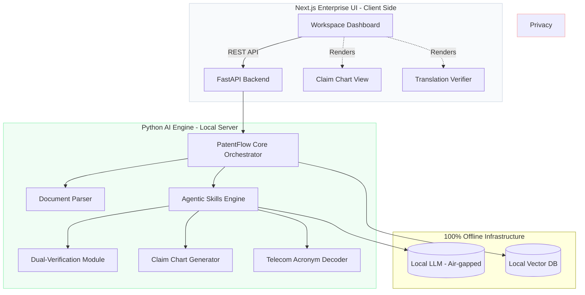

# ⚖️ PatentFlow: Offline-First Patent Prosecution Workspace

**PatentFlow** is an enterprise-grade, privacy-first Document Processing Workspace designed specifically for European Patent Attorneys. It bridges the gap between raw technical specifications (e.g., 3GPP Telecom standards) and strict EPC legal requirements.

*Built by an IP professional, for IP professionals.*

## 💡 The "Why" (Design Philosophy)

After four years of working as a Patent Assistant handling Telecommunications and Optics files, I observed two major bottlenecks in integrating AI into daily firm operations:
1. **Client Confidentiality**: Public cloud AI (like ChatGPT or Claude) is strictly prohibited for unpublished patent drafts and sensitive client communications.
2. **Legal Hallucinations**: Standard LLMs fail to respect rigid EPO frameworks (e.g., Article 123(2) added subject-matter limits, Article 56 inventive step logic).

**PatentFlow** solves this by running a **100% offline local LLM** constrained by deterministic Python "Agent Skills." The tool is wrapped in a minimalist, high-density Next.js UI tailored for heavy document reading, avoiding the inefficient "chatbot" paradigm.

---

## 🏗️ System Architecture

PatentFlow employs a decoupled architecture: a sophisticated React frontend for the attorney workspace, and a robust Python backend for document parsing and local AI orchestration.

