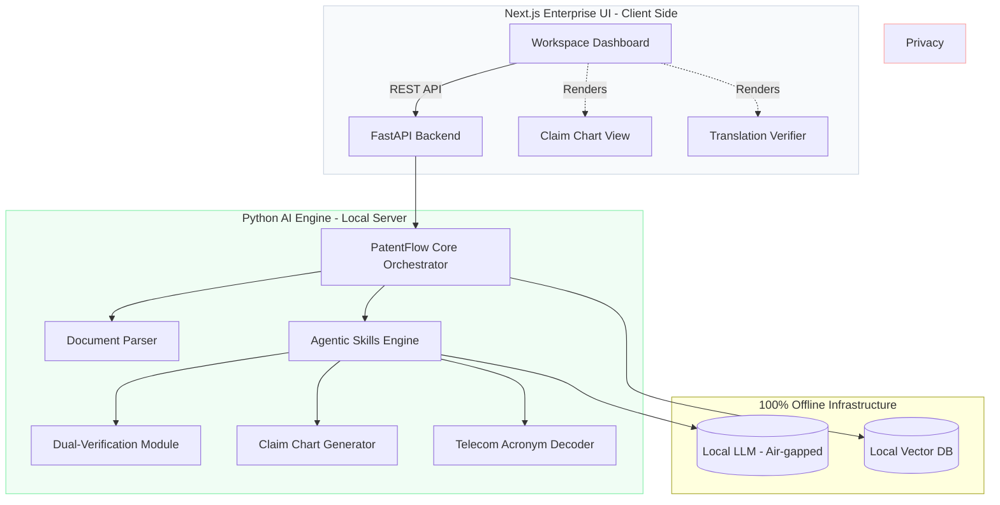

# ⚖️ PatentFlow: Offline-First Patent Prosecution Workspace


**PatentFlow** is an enterprise-grade, privacy-first Document Processing Workspace designed specifically for European Patent Attorneys. It bridges the gap between raw technical specifications (e.g., 3GPP Telecom standards) and strict EPC legal requirements.

*Built by an IP professional, for IP professionals.*

## 💡 The "Why" (Design Philosophy)

After four years of working as a Patent Assistant handling Telecommunications and Optics files, I observed two major bottlenecks in integrating AI into daily firm operations:
1. **Client Confidentiality**: Public cloud AI (like ChatGPT or Claude) is strictly prohibited for unpublished patent drafts and sensitive client communications.
2. **Legal Hallucinations**: Standard LLMs fail to respect rigid EPO frameworks (e.g., Article 123(2) added subject-matter limits, Article 56 inventive step logic).

**PatentFlow** solves this by running a **100% offline local LLM** constrained by deterministic Python "Agent Skills." The tool is wrapped in a minimalist, high-density Next.js UI tailored for heavy document reading, avoiding the inefficient "chatbot" paradigm.

---

## 🏗️ System Architecture

PatentFlow employs a decoupled architecture: a sophisticated React frontend for the attorney workspace, and a robust Python backend for document parsing and local AI orchestration.



---

## ✨ Core Capabilities (Agent Skills)

Unlike standard generative AI, PatentFlow's engine is restricted to specific legal workflows.

> **Note:** The specific system prompts, proprietary 3GPP mapping dictionaries, and heuristic regex parsing algorithms are omitted from this public repository to protect the underlying intellectual logic. The core capabilities demonstrated include:

### 1. Dual-Verification Translation (Art. 123(2) Mitigation)

Designed specifically for Chinese priority applications.

- Generates a strict side-by-side alignment: **Original CN** | **Target EN** | **Back-translated CN**.
- **Logic:** Automatically flags verb-scope mismatches (e.g., detecting if the AI translated the open-ended "包括" as the closed-ended "consisting of") to prevent unallowable amendments.

### 2. Automated Claim Charting (Art. 56 Analysis)

- Parses complex dependent/independent claim structures.
- Maps specific claim features (e.g., 1.1, 1.2) to identified paragraphs in Prior Art (e.g., D1).
- Outputs a clean, actionable data table for the attorney to build their argumentation.

### 3. Deterministic Dependency Checking (Art. 84 Clarity)

- Uses offline code (not AI guessing) to verify antecedent basis ("a device" vs "the device") and claim dependency trees.

---

## 🖥️ User Interface

The frontend is built with **Next.js** and **Tailwind CSS**. It abandons the "chat window" design in favor of a professional terminal layout (inspired by institutional software like Bloomberg Terminal). Features include:

- High-density typography for reading complex patent claims.
- Ultra-compact sidebars for document uploads.
- Tabbed workspaces for structured output review.

### Art. 56 Claim Chart — Feature-by-feature prior art mapping


### Art. 123(2) Translation Verifier — CN↔EN dual-verification with mismatch flagging


### Response Draft — Auto-generated EPO response letter


---

## 🚀 Getting Started (Local Deployment)

Since the system guarantees data privacy, it must be run locally.

### 1. Start the Python Backend

```bash
cd backend
pip install -r requirements.txt
# Ensure your local LLM server (e.g., Ollama) is running on port 11434
uvicorn app:app --reload --port 8000
```

### 2. Start the Next.js Frontend

```bash
cd frontend
npm install
npm run dev
```

Open [http://localhost:3000](http://localhost:3000) in your browser to access the local workspace.

---

> **Disclaimer:** This is a milestone project demonstrating the intersection of software engineering and patent prosecution. It is designed to assist, not replace, the strategic judgment of a qualified European Patent Attorney.
